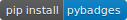
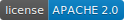
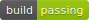
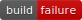
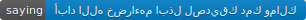

[](https://circleci.com/gh/google/pybadges)


   
# pybadges

pybadges is a Python library and command line tool that allows you to create
Github-style badges as SVG images. For example:





The aesthetics of the generated badges matches the  visual design found in this
[specification](https://github.com/badges/shields/blob/master/spec/SPECIFICATION.md).

The implementation of the library was heavily influenced by
[Shields.io](https://github.com/badges/shields) and the JavaScript
[gh-badges](https://github.com/badges/shields#using-the-badge-library) library.

## Getting Started

### Installing

pybadges can be installed using [pip](https://pypi.org/project/pip/):

```sh
pip install pybadges
```

To test that installation was successful, try:
```sh
python -m pybadges --left-text=build --right-text=failure --right-color='#c00' --browser
```

You will see a badge like this in your browser:



## Usage

pybadges can be used both from the command line and as a Python library.

The command line interface is a great way to experiment with the API before
writing Python code.

### Command line usage

Complete documentation of pybadges command arguments can be found using the `--help`
flag:

```sh
python -m pybadges --help
```

But the following usage demonstrates every interesting option:
```sh
python -m pybadges \
    --left-text=complete \
    --right-text=example \
    --left-color=green \
    --right-color='#fb3' \
    --left-link=http://www.complete.com/ \
    --right-link=http://www.example.com \
    --logo='data:image/png;base64,iVBORw0KGgoAAAANSUhEUgAAAAIAAAACCAIAAAD91JpzAAAAD0lEQVQI12P4zwAD/xkYAA/+Af8iHnLUAAAAAElFTkSuQmCC' \
    --embed-logo \
    --whole-title="Badge Title" \
    --left-title="Left Title" \
    --right-title="Right Title" \
    --browser
```


#### A note about `--logo` and `--embed-logo`

Note that the `--logo` option can include a regular URL:

```sh
python -m pybadges \
    --left-text="python" \
    --right-text="3.2, 3.3, 3.4, 3.5, 3.6" \
    --whole-link="https://www.python.org/" \
    --browser \
    --logo='https://dev.w3.org/SVG/tools/svgweb/samples/svg-files/python.svg'
```


If the `--logo` option is set, the `--embed-logo` option can also be set.
The `--embed-logo` option causes the content of the URL provided in `--logo`
to be embedded in the badge rather than be referenced through a link.

The advantage of using this option is an extra HTTP request will not be required
to render the badge and that some browsers will not load image references at all.

You can see the difference in your browser:

 

#### A note about `--(whole|left|right)-title`

The `title` element is usually displayed as a
[pop-up by browsers](https://developer.mozilla.org/en-US/docs/Web/SVG/Element/title)
but is currently
[filtered by Github](https://github.com/github/markup/issues/1267).


### Library usage

pybadges is primarily meant to be used as a Python library.

```python
from pybadges import badge
s = badge(left_text='coverage', right_text='23%', right_color='red')
# s is a string that contains the badge data as an svg image.
print(s[:40]) # => <svg height="20" width="191.0" xmlns="ht
```

The keyword arguments to `badge()` are identical to the command flags names
described above except with keyword arguments using underscore instead of
hyphen/minus (e.g. `--left-text` => `left_text=`)

### Caveats

 - pybadges uses a pre-calculated table of text widths and
   [kerning](https://en.wikipedia.org/wiki/Kerning) distances
   (for western glyphs) to determine the size of the badge.
   So Eastern European languages may be rendered less well than
   Western European ones:

   

   and glyphs not present in Deja Vu Sans (the default font) may
   be rendered very poorly:

    

 - pybadges does not have any explicit support for languages that
   are written right-to-left (e.g. Arabic, Hebrew) and the displayed
   text direction may be incorrect:

    

## Development

```sh
git clone https://github.com/google/pybadges.git
cd pybadges
python -m virtualenv venv
source venv/bin/activate
# Installs in edit mode and with development dependencies.
pip install -e .[dev]
nox
```

If you'd like to contribute your changes back to pybadges, please read the
[contributor guide.](CONTRIBUTING.md)

## Versioning

We use [SemVer](http://semver.org/) for versioning.

## License

This project is licensed under the Apache License - see the [LICENSE](LICENSE) file for details

This is not an officially supported Google product.
